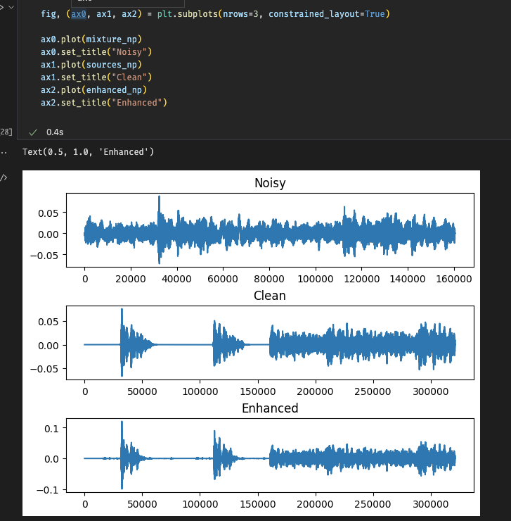
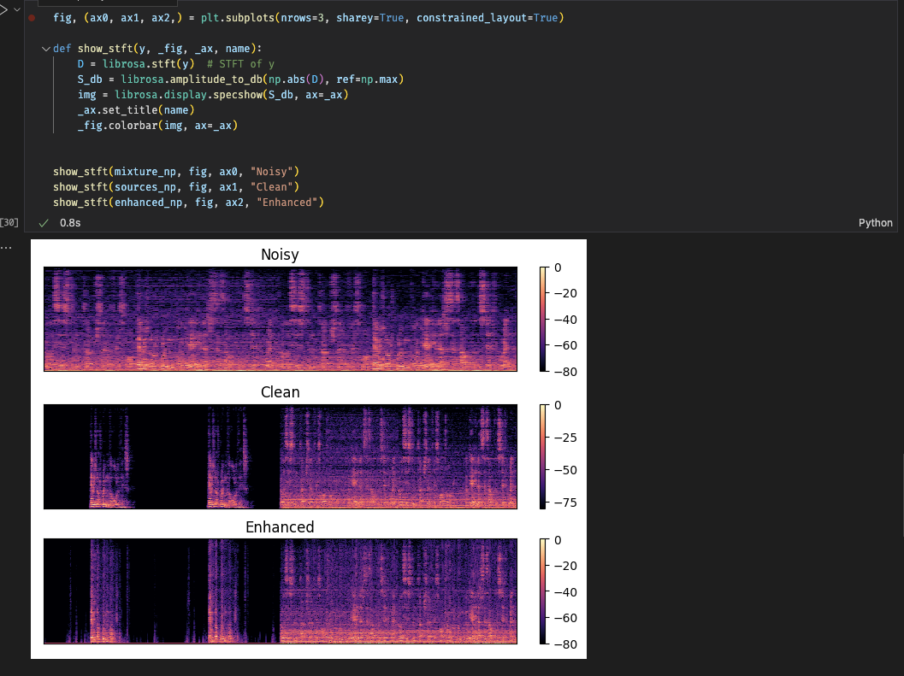

# Deep Learning model for Speech Separation / Speech Enhancement

This repository is for desiging and training Deep Learning(DL) model for Speech Separation/Speech Enhancement originally for [2023 Clarity Challenge](https://claritychallenge.org). It used in [2023 Clarity Challenge framework](https://github.com/ooshyun/ClarityChallenge2023), and also can train/evaluate DL Models. Before the main contents, the naming source is from [denoiser](https://github.com/facebookresearch/denoiser)

## Pipeline 
- Dataset
    - VoiceBankDEMAND
    - ClarityChallenge2023
- Dataloader
- Solver 
- Model
- Inference

## Model Design

DL models are for single channel, single sources, and multi-speakers Speech Separation. Each model has a property of dataset, which tested in model/model_name.py main part. Each of models are from implementations from other repository whose some of them are modified for its target parameters. The list of models are as below,

- [How to calculate model size?](https://discuss.pytorch.org/t/finding-model-size/130275/2)

### Model list
- Deep Neural Network
    - Input: STFT form
    - Output: STFT form
    - Model size: 10.324MB

- Recurrent Neural Network type models
    - Input: STFT form
    - Output: STFT form
    - Model size: 1.379MB

- Convolutional Recurrent Network(CRN)
    - Input: STFT form
    - Output: STFT form
    - Source code: https://github.com/haoxiangsnr/A-Convolutional-Recurrent-Neural-Network-for-Real-Time-Speech-Enhancement/
    - Model size: 3.004MB
    - [TODO] loss is currently NaN

- Deep Complex Convolutional Recurrent Network(DCCRN)
    - Input: wav form
    - Output: wav form
    - Source code: https://github.com/huyanxin/DeepComplexCRN
    - Model size: 9.390MB

- Unet
    - Input: STFT form, real and imag
    - Output: STFT form, real and imag
    - Source code: https://github.com/milesial/Pytorch-UNet/blob/master/unet/unet_parts.py
    - Model size: 7.513MB

- WavUnet
    - Input: Wavform
    - Output: Wavform
    - Source code: https://github.com/haoxiangsnr/Wave-U-Net-for-Speech-Enhancement
    - Model size: 38.685MB

- DCUnet
    - Input: STFT form, real and imag
    - Output: STFT form, real and imag
    - Source code
        - https://github.com/sweetcocoa/DeepComplexUNetPyTorch.git
        - https://github.com/pheepa/DCUnet
    - Model size: 7.510MB

- Demucs v2
    - Input: channels and wavform
    - Output: channels and wavform
    - Source code: https://github.com/facebookresearch/denoiser
    - Model size: 510.220MB

- ConvTasNet
    - Input: channels and wavform 
    - Output: sources, channels and wavform
    - Source code
        - https://github.com/kaituoxu/Conv-TasNet/blob/master/src/conv_tasnet.py
        - https://github.com/facebookresearch/demucs/blob/v2/demucs/tasnet.py
    - Model size: 0.001MB

- Sepformer
    - Input: channels and wavform 
    - Output: sources, channels and wavform
    - Source code: https://github.com/speechbrain/speechbrain
    - Model size: 110.736MB
    - [TODO] Only tested loading model

- [TODO] Implementation
    - Model
        - CRNN: https://github.com/haoxiangsnr/A-Convolutional-Recurrent-Neural-Network-for-Real-Time-Speech-Enhancement
        - Demucs(Implemented in Pytorch)
            - Demucs v3, Demucs Transformer: https://github.com/facebookresearch/demucs
        - Conformer GAN: https://github.com/ruizhecao96/CMGAN
        - SEGAN: https://github.com/santi-pdp/segan
        - Dual-signal Transfomration LSTM: https://github.com/breizhn/DTLN
        - Full subnet: https://github.com/haoxiangsnr/FullSubNet
        - Hifi GAN
        - Tasnet
            - Encoder-Decoder-Tasnet
            - Dillated-tasnet(wavnet)
	- Feature
        - Loudness
        - Log-spectrogram
        - Per-Channel Energy Normalization

### Library 
- If want to analyze with amplified signal, then refers https://github.com/ooshyun/ClarityChallenge2023
- This library is for RTK3090
    - pip install torch==1.7.1+cu110 torchvision==0.8.2+cu110 torchaudio==0.7.2 -f https://download.pytorch.org/whl/torch_stable.html
    - pyyaml==6.0
    - julius==0.2.7
    - librosa==0.9.2
    - tqdm==4.64.1
    - matplotlib==3.6.3
    - tensorboard==2.11.2
    - torchmetrics==0.5.1
    - pesq==0.0.4
    - pypesq==1.2.4
    - pystoi==0.3.3
    - museval==0.4.0
    - pynvml==11.4.1
    - typing

- It tested MacOS and Linux with RTK3090. When testing MacOS, it only change pytoch verion

- The difference is  torch 1.13.1 and torch 1.7.1, which makes torch.concat and torch.cat function.

### Result
- Currenlty, it denoised as below wav file, but still contiute to training.

- Wavform
    

- Spetrogram

